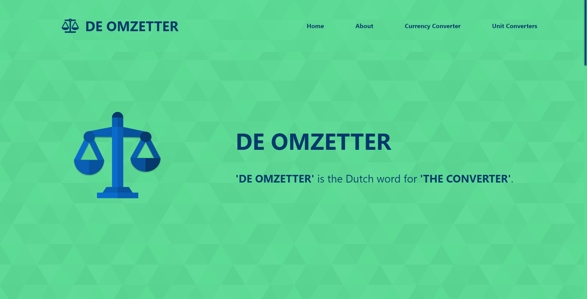

<h1 align="center">DE OMZETTER | The Converter</h1>

  
<b>'DE OMZETTER' A.K.A 'The Converter'</b>. Provides the functionalities such as, 'Currency Converter' & 'Unit Converters' (Length, Weight, Time, Temperature & Speed).

 

---

## 💻 LIVE DEMO

View [De Omzetter](https://de-omzetter-ebinjs.netlify.app/)

 

## ⚖️ GUIDANCE

Mainly two forms of converters :
1. Currency Converter
2. Unit Converters

- Currency Converter
   - Allows currency conversion
   - Uses REST API
   - Automatically changes conversion rate as per the changes over each currency

- Unit Converters
   - 5 different unit converters
   - Length, Weight, Time, Temperature & Speed.
   - Simultaneously converts every fields for each of the unit converters
 
 `Contact is provided at the bottom of the webpage`
 
 `For any suggestions & improvements please contact through any of the provided platforms.`
 
>Keen on getting suggestions🤩. Cheers 😇
 
  
 
 ---
